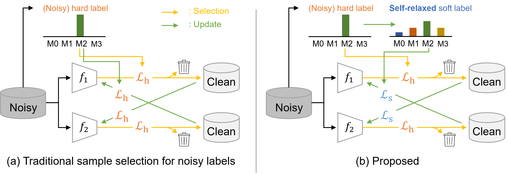

# Self-Relaxed Joint Training: Sample Selection for Severity Estimation with Ordinal Noisy Labels [[S.Takezaki+, WACV2025](http://arxiv.org/abs/2410.21885)]

Shumpei Takezaki, Kiyohito Tanaka, Seiichi Uchida



>Severity level estimation is a crucial task in medical image diagnosis. However, accurately assigning severity class labels to individual images is very costly and challenging. Consequently, the attached labels tend to be noisy. In this paper, we propose a new framework for training with ``ordinal'' noisy labels. Since severity levels have an ordinal relationship, we can leverage this to train a classifier while mitigating the negative effects of noisy labels. Our framework uses two techniques: clean sample selection and dual-network architecture. A technical highlight of our approach is the use of soft labels derived from noisy hard labels. By appropriately using the soft and hard labels in the two techniques, we achieve more accurate sample selection and robust network training. The proposed method outperforms various state-of-the-art methods in experiments using two endoscopic ulcerative colitis (UC) datasets and a retinal Diabetic Retinopathy (DR) dataset.

## Requirements
- [Ubuntu 20.04 Desktop](https://ubuntu.com/download)
- [Python](https://www.python.org/) and [Pytorch](https://pytorch.org/)
- [Docker](https://www.docker.com/)


## Create a development environment
```bash
$ sh docker/build.sh
$ sh docker/run.sh
$ sh docker/exec.sh
```

## Download clean dataset ([LIMUC](https://zenodo.org/records/5827695#.YuNBddLP1hH)) and create noisy dataset
Donwload dataset and are create noisy label. Please see sample code `run_dataset.sh`

Parameters:
- `NOISE_TYPE`: [quasi, truncated]
- `NOISE_RATE`: [0.2, 0.4]

```bash
$ chmod +x run_dataset.sh
$ NOISE_TYPE=quasi NOISE_RATE=0.2 ./run_dataset.sh 
```

## Experiments (5-fold-validation)
Trraining and evaluation. Please see sample code `run_train.sh` 

Parameters:
- `NOISE_TYPE`: [quasi, truncated]
- `NOISE_RATE`: [0.2, 0.4]
- `METHOD`: [standard, sord, f_correction, reweight, mixup, cdr, garg, co_teaching, **co_teaching_ours**, co_teaching_abl, jocor, **jocor_ours**, codis, **codis_ours**]

```bash
$ chmod +x run_train.sh
$ NOISE_TYPE=quasi NOISE_RATE=0.2 METHOD=co_teaching_ours ./run_train.sh
```

## Citation
coming soon...